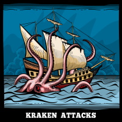
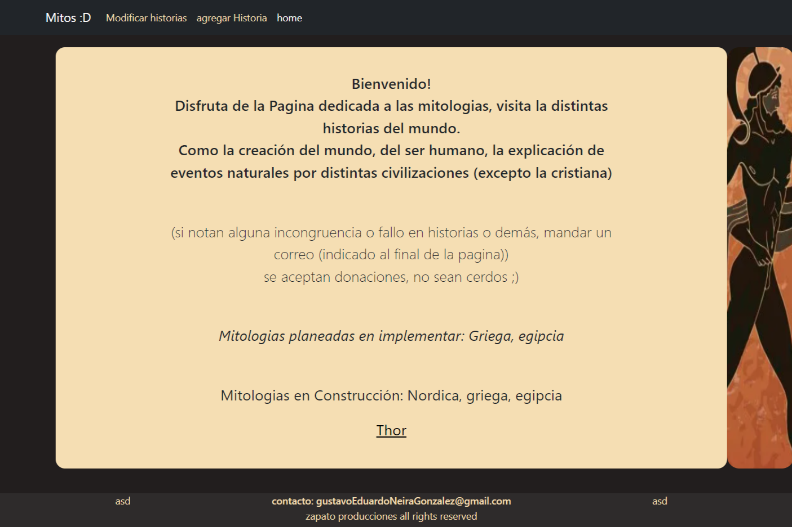
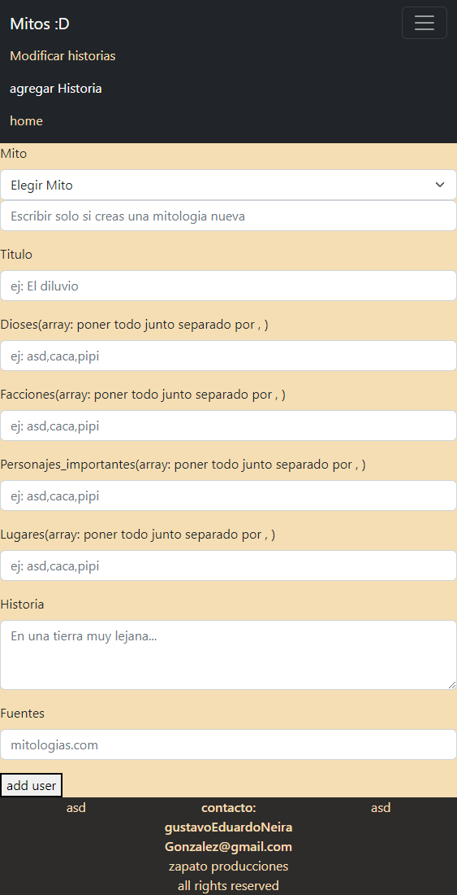
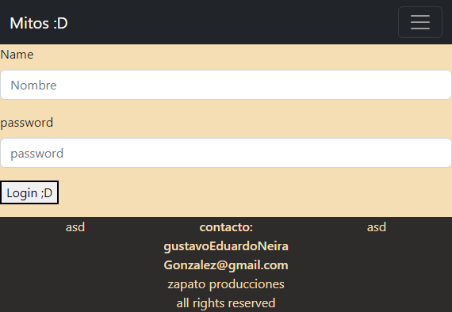

<div align="center">
  <a href="https://github.com/GustavoNeiraGonzalez/mitologias" rel="noopener">
    
  </a>
</div>

<h1 align="center">Mitologías</h1>

<div align="center">

[](https://reactjs.org/)

</div>

<div align="center">
  Disfruta de la Pagina dedicada a las mitologias, visita la distintas historias del mundo.
</div>

## 📘 Últimas actualizaciones 👀
- Documentación creada.

## 📝 Contenidos 📂

- [¿Qué es este proyecto?](#about)
- [¡Empecemos!](#getting_started)
- [Prerequisitos](#prerequisites)
- [Instalación](#installing)
- [¿Cómo usar?](#usage)
- [Producción](#deployment)
- [Contribuir](../CONTRIBUTING.md)
- [Tecnologías usadas](#built_using)
- [Autores](#authors)
- [Reconocimientos](#acknowledgement)

## 🧐 ¿Qué es este __Mitologías__ ? <a name = "about"></a>

Disfruta de la Pagina dedicada a las mitologias, visita la distintas historias del mundo, como la creación del mundo, del ser humano, la explicación de eventos naturales por distintas civilizaciones.

<div align="center">
  <a href="https://github.com/GustavoNeiraGonzalez/mitologias" rel="noopener">
    
  </a>
</div>

## 🏁 ¡Empecemos! <a name = "getting_started"></a>

Sigue las siguientes instrucciones para ejecutar el FrontEnd y el BackEnd. Ver [Producción](#deployment) para lanzar una versión final.

### 📘 Prerequisitos <a name = "prerequisites"></a>

- Instalar [Git](https://git-scm.com/downloads)

- Instalar [Node](https://nodejs.org/en/download/)

- Instalar [Mongo](https://www.mongodb.com/try/download/community)

###  🔧 Instalación <a name = "installing"></a>

Primero clonar este proyecto.

```sh
git clone https://github.com/GustavoNeiraGonzalez/mitologias
cd mitologias
```

Instalar las dependencias/módulos del FrontEnd y der BackEnd.

```sh
cd client
npm install
cd ..
```

```sh
cd server
npm install
```

## 🎈 Modo de uso <a name = "usage"></a>

Entrar a la carpeta principal del proyecto y en **DOS terminales distintas** escribir los siguientes comandos.

### Terminal 1, levantar el FrontEnd

```sh
cd client
npm run start
```

### Terminal 2, levantar el BackEnd

```sh
cd server
npm run start
```

## 🚀 Producción <a name = "deployment"></a>

Para pasar a producción, alojar la base de datos, el front y el back en alguna nube, exponer los puertos, habilitar CORS y listo.

## ⛏️ Tecnologías usadas <a name = "built_using"></a>

- [MongoDB](https://www.mongodb.com/) - Base de datos
- [Express](https://expressjs.com/) - Framework de servidores
- [ReactJS](https://reactjs.org/) - Framework para cliente
- [NodeJs](https://nodejs.org/) - Entorno del servidor

## ✍️ Autores 👌 <a name = "authors"></a>

- [Gustavo Neira Gonzalez](https://github.com/GustavoNeiraGonzalez) - Autor del proyecto.
- [Marfullsen](https://github.com/Marfullsen) - Mantenedor.

# Screenshots
<div align="center">
  <a href="https://github.com/GustavoNeiraGonzalez/mitologias/" rel="noopener">
    
  </a>

  <a href="https://github.com/GustavoNeiraGonzalez/mitologias/" rel="noopener">
    
  </a>

  <a href="https://github.com/GustavoNeiraGonzalez/mitologias/" rel="noopener">
    
  </a>
</div>

## 🎉 Reconocimientos, agreadecimientos y más. <a name = "acknowledgement"></a>

- [React](https://reactjs.org/)
- [GitIgnore](https://github.com/github/gitignore)
- <a href="https://www.freepik.es/vector-gratis/velero-logotipo-vector-pulpo-monstruo-kraken-estilo-dibujos-animados-calamar-mito-tentaculo-ilustracion-viaje-aventura_10600922.htm#query=myth&position=1&from_view=search&track=sph">Imagen de Kraken</a> en Freepik
